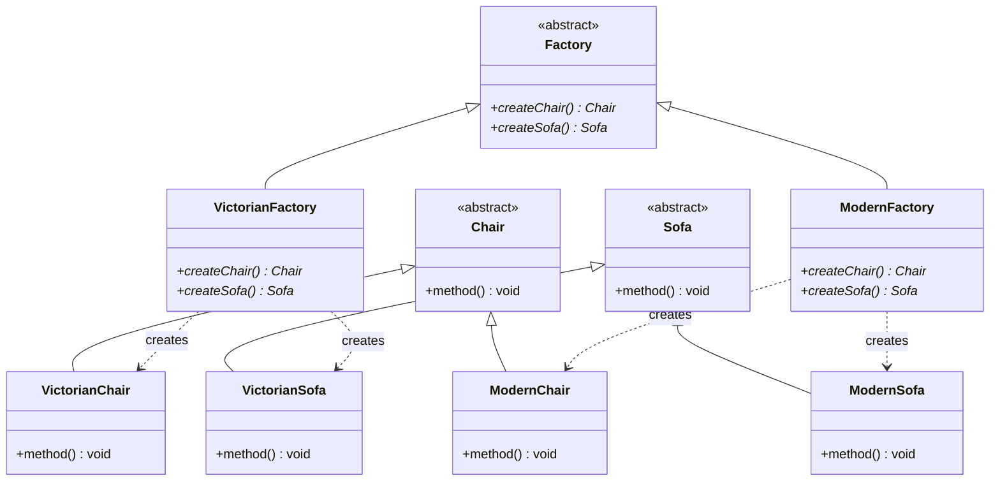

# Abstract Factory

## Intent

Provide an interface for creating **families of related objects** without specifying their concrete classes.

## When to use

- A system must be independent of how its products are created.
- You need to enforce that products from the same family are used together (e.g., Victorian Chair with Victorian Sofa).
- You want to swap entire product families easily by switching the factory.

## Key points

- `Factory` declares factory methods for each product type in the family (`createChair`, `createSofa`).
- `VictorianFactory` and `ModernFactory` each produce a consistent family of products.
- Client code only depends on abstract interfaces (`Chair`, `Sofa`, `Factory`) — concrete types are invisible to it.
- Compared to Factory Method, Abstract Factory creates multiple related products rather than one.

## Structure



## Files

| File | Description |
|------|-------------|
| `product.hpp` | Abstract `Chair`/`Sofa` interfaces and concrete product declarations |
| `product.cpp` | Concrete product `method()` implementations |
| `factory.hpp` | Abstract `Factory` and concrete factory declarations |
| `factory.cpp` | Concrete factory `createChair`/`createSofa` implementations |
| `main.cpp` | Demo: creating Victorian and Modern furniture families |

## Build & run

```bash
make        # build
make run    # build and run
make clean  # remove binary
```
