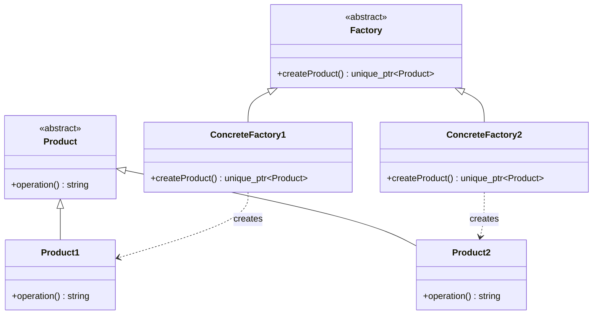

# Factory Method

## Intent

Define an interface for creating an object but let subclasses decide which class to instantiate. Factory Method lets a class defer instantiation to subclasses.

## When to use

- You don't know ahead of time what class you need to instantiate.
- You want subclasses to specify the objects they create.
- You need to decouple product creation from the code that uses the product.

## Key points

- `Factory` declares a pure virtual `createProduct()` — this is the factory method.
- Concrete factories (`ConcreteFactory1`, `ConcreteFactory2`) override it to return the appropriate product.
- Products are returned as `std::unique_ptr<Product>`, ensuring automatic memory management.
- Client code works against the abstract `Product` interface, unaware of concrete types.

## Structure



## Files

| File | Description |
|------|-------------|
| `product.hpp` | Abstract `Product` and concrete `Product1`/`Product2` declarations |
| `product.cpp` | `Product1::operation()` and `Product2::operation()` implementations |
| `factory.hpp` | Abstract `Factory` and concrete factory declarations |
| `factory.cpp` | Concrete factory `createProduct()` implementations |
| `main.cpp` | Demo: client code using both factories polymorphically |

## Build & run

```bash
make        # build
make run    # build and run
make clean  # remove binary
```
