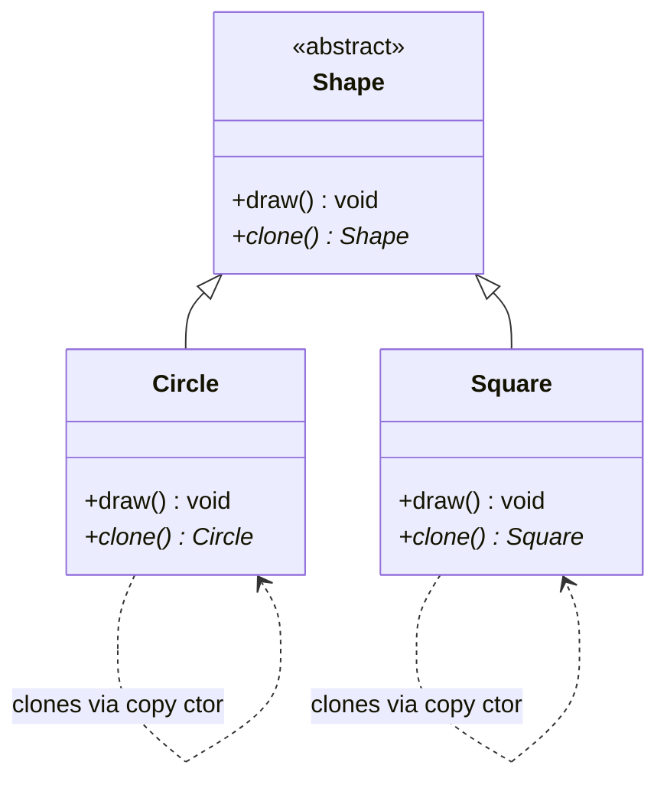

# Prototype

## Intent

Create new objects by **cloning an existing object** (the prototype) instead of constructing from scratch.

## When to use

- Object creation is expensive and a copy of an existing object is cheaper.
- You need copies of objects at runtime without coupling to their concrete classes.
- You want to avoid building a class hierarchy of factories parallel to a class hierarchy of products.

## Key points

- `Shape` defines a pure virtual `clone()` method that each subclass must implement.
- Each concrete class (`Circle`, `Square`) implements `clone()` using its own copy constructor.
- The caller only needs a pointer to `Shape` — it never needs to know the concrete type to make a copy.

## Structure



## Files

| File | Description |
|------|-------------|
| `prototype.hpp` | Abstract `Shape` interface and `Circle`/`Square` declarations |
| `prototype.cpp` | `clone()` and `draw()` implementations |
| `main.cpp` | Demo: cloning circles and squares and drawing them |

## Build & run

```bash
make        # build
make run    # build and run
make clean  # remove binary
```
