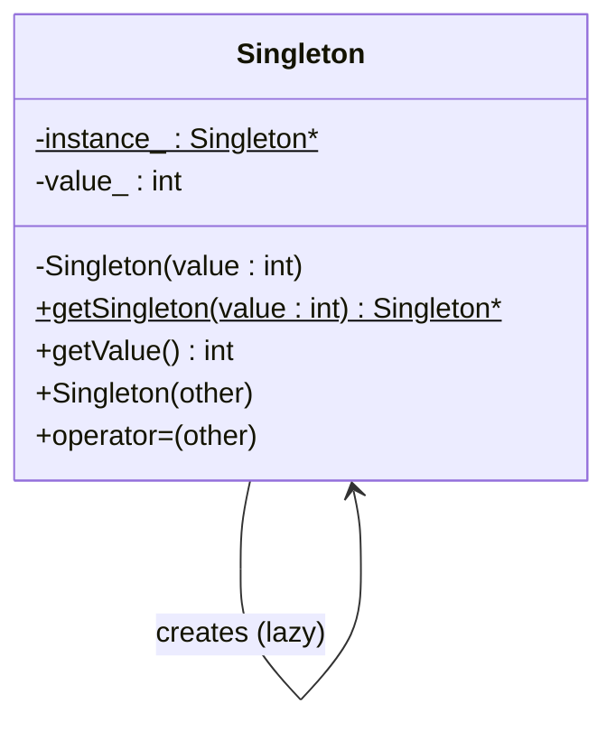

# Singleton

## Intent

Ensure a class has only one instance and provide a global access point to it.

## When to use

- You need exactly one object to coordinate actions across a system (e.g., a logger, config manager, or thread pool).
- You want to control shared access to a resource.

## Key points

- The constructor is **private** — clients cannot call `new Singleton()`.
- A static method (`getSingleton`) acts as the global access point.
- Copy constructor and assignment operator are **deleted** to prevent duplication.
- This implementation is **not thread-safe** — if two threads call `getSingleton` simultaneously before the instance is created, they may each create their own instance. The `main.cpp` demo intentionally shows this race condition.

## Structure



## Files

| File | Description |
|------|-------------|
| `singleton.hpp` | Class declaration |
| `singleton.cpp` | Static member init and `getSingleton` implementation |
| `main.cpp` | Demo: two threads race to create the singleton |

## Build & run

```bash
make        # build
make run    # build and run
make clean  # remove binary
```
